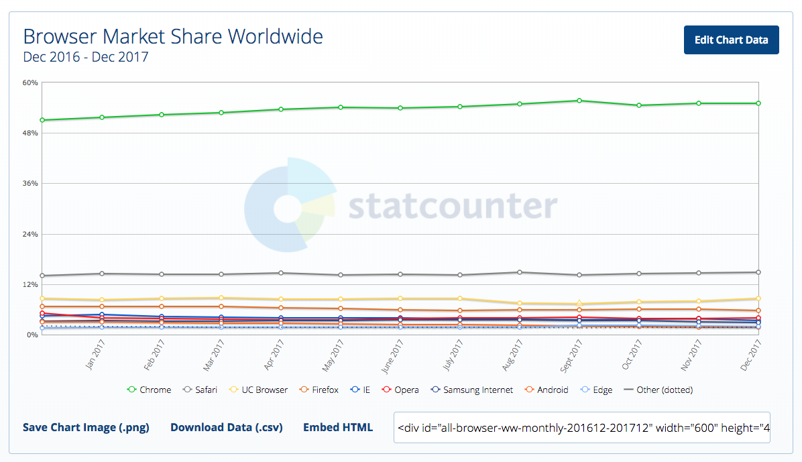

# 了解 Web 浏览器

> Web 浏览器（通常称为浏览器）是用于检索，呈现和遍历万维网上的信息资源的软件应用程序。信息资源由统一资源标识符（URI / URL）标识，可以是网页，图像，视频或其他内容。资源中存在的超链接使用户可以轻松地将浏览器导航到相关资源。尽管浏览器主要用于使用万维网，但它们也可用于访问专用网络中的Web服务器或文件系统中的文件提供的信息。

><cite>&#8212; [维基百科](https://en.wikipedia.org/wiki/Web_browser)</cite>

#####  [常用浏览器](https://www.sitepoint.com/browser-trends-september-2016-browser-wars/) (任何设备中) :

1. [Chrome](http://www.google.com/chrome/) ( 引擎 : [Blink](https://en.wikipedia.org/wiki/Blink_%28layout_engine%29) + [V8](https://en.wikipedia.org/wiki/V8_%28JavaScript_engine%29))
2. [Firefox](https://www.mozilla.org/en-US/firefox/new/) (  引擎 : [Gecko](https://en.wikipedia.org/wiki/Gecko_%28software%29) + [SpiderMonkey](https://en.wikipedia.org/wiki/SpiderMonkey_%28software%29))
3. [Internet Explorer](http://windows.microsoft.com/en-us/internet-explorer/download-ie) ( 引擎 : [Trident](https://en.wikipedia.org/wiki/Trident_%28layout_engine%29) + [Chakra](https://en.wikipedia.org/wiki/Chakra_%28JScript_engine%29))
4. [Safari](https://www.apple.com/safari/) ( 引擎 : [Webkit](https://en.wikipedia.org/wiki/WebKit) + [SquirrelFish](https://trac.webkit.org/wiki/SquirrelFish))

<cite>图片来源: <a href="http://gs.statcounter.com/browser-market-share">http://gs.statcounter.com/browser-market-share</a></cite>

##### 浏览器和 Web 技术 (APIs) 的演变

* [Web 的演变](http://www.evolutionoftheweb.com/) [阅读]
* [Web 浏览器的时间表](https://en.wikipedia.org/wiki/Timeline_of_web_browsers) [阅读]

##### 最常用的  [无头浏览器](http://www.asad.pw/HeadlessBrowsers/) :

* [Headless Chromium](https://chromium.googlesource.com/chromium/src/+/lkgr/headless/README.md) ( 引擎 : [Blink](https://www.chromium.org/blink) + V8)
* [PhantomJS](http://phantomjs.org/) (引擎 : [Webkit](https://en.wikipedia.org/wiki/WebKit) + SquirrelFish)
* [SlimerJS](http://slimerjs.org/) (引擎: [Gecko](https://en.wikipedia.org/wiki/Gecko_%28software%29) + [SpiderMonkey](https://en.wikipedia.org/wiki/SpiderMonkey_%28software%29))
* [TrifleJS](https://github.com/sdesalas/trifleJS) ( 引擎 : [Trident](https://en.wikipedia.org/wiki/Trident_%28layout_engine%29) + [Chakra](https://en.wikipedia.org/wiki/Chakra_%28JScript_engine%29))

##### 浏览器如何工作

* [关于浏览器和 Web 我学到的 20 件事](http://www.20thingsilearned.com/en-US/foreword/1) [阅读]
* [高效 CSS: 浏览器如何展示页面](http://dbaron.org/talks/2012-03-11-sxsw/master.xhtml) [阅读]
* [浏览器如何工作 : 现代 Web 浏览器的幕后](http://www.html5rocks.com/en/tutorials/internals/howbrowserswork/) [阅读]
* [走近 Quantum : 什么是浏览器引擎 ?](https://hacks.mozilla.org/2017/05/quantum-up-close-what-is-a-browser-engine/)
* [浏览器如何渲染网页](https://www.youtube.com/watch?v=SmE4OwHztCc) [阅读]
* [What forces layout / reflow](https://gist.github.com/paulirish/5d52fb081b3570c81e3a) [阅读]
* [前端开发者应该了解的网页渲染](http://frontendbabel.info/articles/webpage-rendering-101/) [阅读]

<cite>图片来源: <a href="http://www.html5rocks.com/en/tutorials/internals/howbrowserswork/">http://www.html5rocks.com/en/tutorials/internals/howbrowserswork/</a></cite>

##### 浏览器优化:

* [浏览器渲染优化](https://www.udacity.com/course/browser-rendering-optimization--ud860) [观看]
* [ 网站性能优化](https://www.udacity.com/course/website-performance-optimization--ud884) [观看]

##### 浏览器比较

* [Web 浏览器比较](https://en.wikipedia.org/wiki/Comparison_of_web_browsers) [阅读]

##### 浏览器黑客

* [browserhacks.com](http://browserhacks.com/) [阅读]

##### 浏览器开发

过去，前端开发者花费大量时间在多个不同的浏览器上编写代码。这是比现在遇到的还要严重的问题。现在，抽象化（ 如 jQuery，React，Post-CSS，Babel 等 ）与现代浏览器相结合，使得浏览器开发变得相当容易。新的挑战不在于用户使用哪种浏览器，而是在哪个设备上运行浏览器。+

##### 自动更新浏览器

现代浏览器的最新版本被认为是自动更新浏览器。也就是说，上他们在不提示用户的情况下自动更新自己。自动更新浏览器的这一行为，是对淘汰不自动更新旧浏览器的缓慢进程的反应。

#####  选择浏览器 [^1]

到目前为止，大多数前端开发人员使用 Chrome 和“ Chrome dev Tools”来开发前端代码。 然而，最常用的现代浏览器都提供了一种开发工具的味道。选择一个用于开发是一种主观的选择。更重要的问题是要知道哪些浏览器在哪些设备上必须支持并适当测试。

***

###### 建议 :

[^1]  我推荐使用 chrome 浏览器，它的开发者工具在不断改进，而且目前拥有最强大的功能
